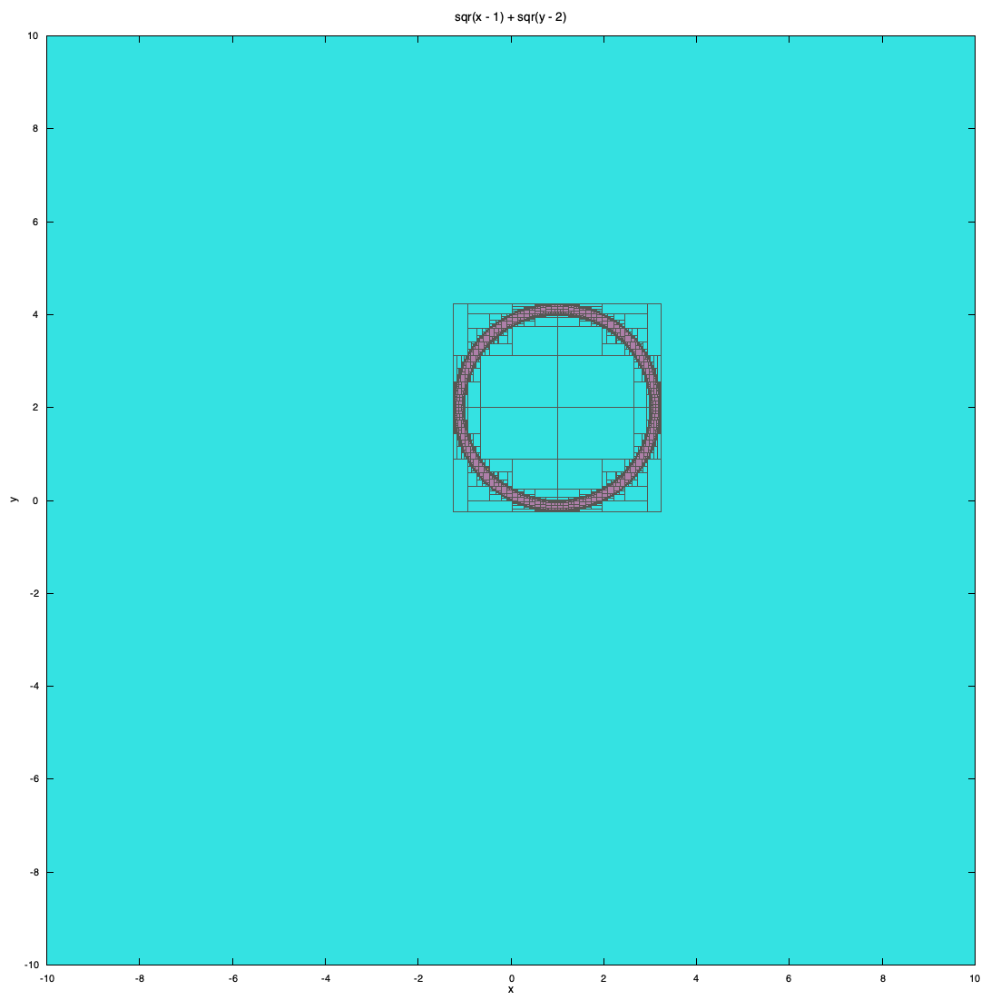
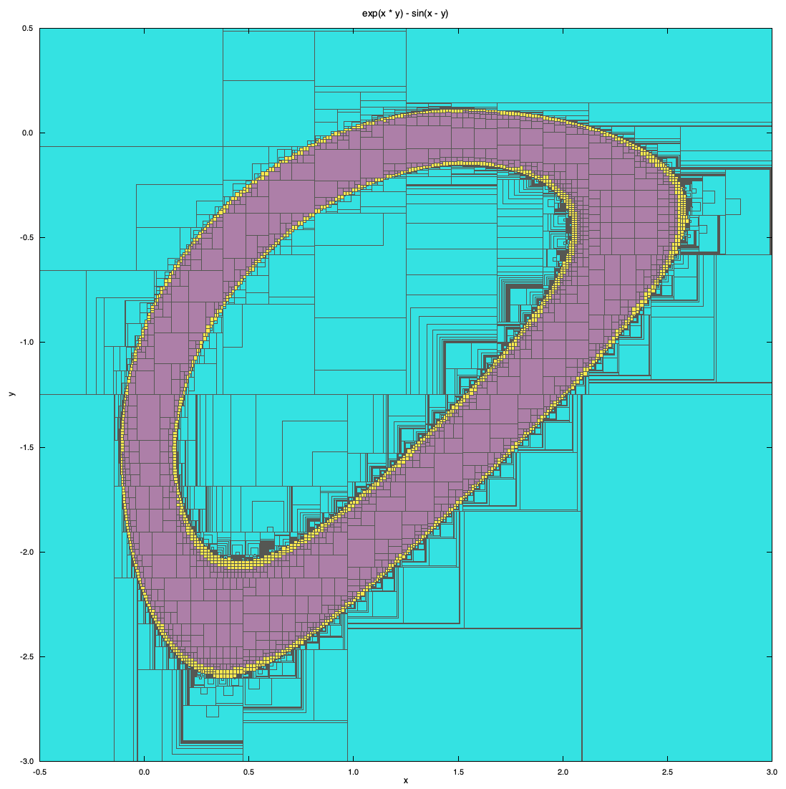

## Comparaison de la vitesse d'execution de contracteurs

## Présentation des cas de test
2 contracteurs sont ici évalués : 

> Contracteur sur un anneau : 
<strong> sqr(x - 1) + sqr(y - 2) </strong>

> Contracteur avec expression non linéaire : 
<strong> exp(x * y) - sin(x - y) </strong>

## Implémentations des contracteurs

> Le contracteur forward backward issu de rico est exprimé avec les fonctions ibex en dérivant de la classe contracteur standard :

        class ManualRing : public Ctc {

	        public:

		        ManualRing(int nb_var) : Ctc(nb_var) {}

		        void contract(IntervalVector& X) {

                    Interval& x = X[0];
                    Interval& y = X[1];
                    Interval cx(1,3);
                    Interval cy(2,4);
                    Interval r(4,5);

                    Interval a = (x - cx);
                    Interval b = (y - cy);
                    Interval a2 = sqr(a);
                    Interval b2 = sqr(b);
                    Interval r2 = sqr(r);

                    bwd_add(r2, a2, b2);
		            bwd_sqr(a2, a);
		            bwd_sqr(b2, b);
		            bwd_sub(a, x, cx);
		            bwd_sub(b, y, cy);
                    return;
		        }
        };

> L'équivalent en parcours d'arbre via ibex est construit comme ceci ' :

        CtcFwdBwd TreeRing(){
        
        	Interval cx(1,3);
            Interval cy(2,4);
        	Interval r(4, 5);

        	Variable x,y;
        	Function f(x,y,sqr(x - cx) + sqr(y - cy));
        	CtcFwdBwd ctr(f, sqr(r));
        	return ctr;
        }

## Procédure de test
On tire 1 million de boîtes valides aléatoirement.
On stocke ces boîtes dans un array pour référence et on appelle tour à tour chacun des contracteurs sur ces boîtes.

## Résultats

> contracteur anneau

|       | compilé | arbre   | conformité | speedup |
|-------|---------|---------|------------|---------|
| run 1 | 80 ms   | 1448 ms | 100 %      | 18.1    |
| run 2 | 80 ms   | 1461 ms | 100 %      | 18.3    |
| run 3 | 79 ms   | 1437 ms | 100 %      | 18.2    |

> contracteur non linéaire

|       | compilé  | arbre   | conformité | speedup |
|-------|----------|---------|------------|---------|
| run 1 | 429 ms   | 1224 ms | 100 %      | 2.8     |
| run 2 | 451 ms   | 1259 ms | 100 %      | 2.8     |
| run 3 | 437 ms   | 1274 ms | 100 %      | 2.8     |

